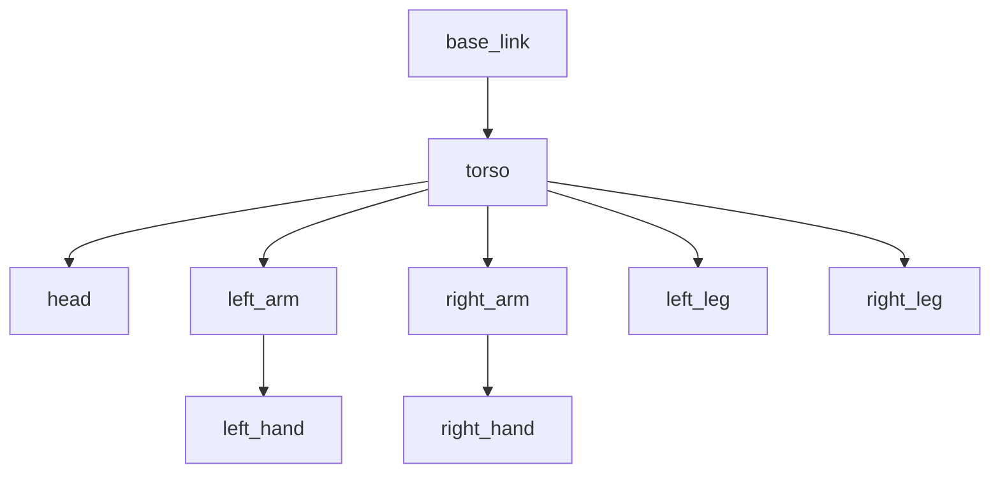

# URDF Anatomy

**URDF (Unified Robot Description Format)** is an XML format used to describe the physical structure of a robot.

## Links & Joints

*   **Link**: A rigid body (e.g., forearm, hand).
*   **Joint**: The connection between two links (e.g., elbow hinge).

## Visualizing the Tree

The robot is a kinematic tree. The **Base Link** is the root (usually the pelvis/torso for humanoids).



## XML Structure

```xml
<robot name="my_robot">
  <link name="base_link">
    <visual>
      <geometry>
        <box size="0.6 0.1 0.2"/>
      </geometry>
    </visual>
  </link>

  <joint name="base_to_torso" type="fixed">
    <parent link="base_link"/>
    <child link="torso"/>
  </joint>
</robot>
```
